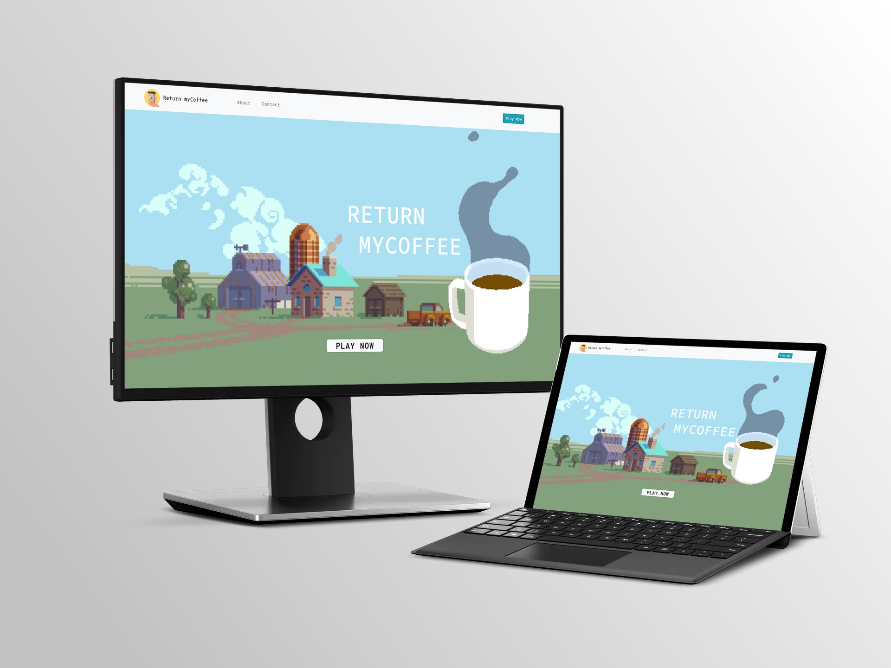
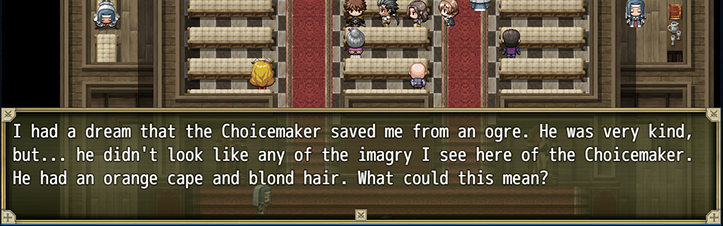
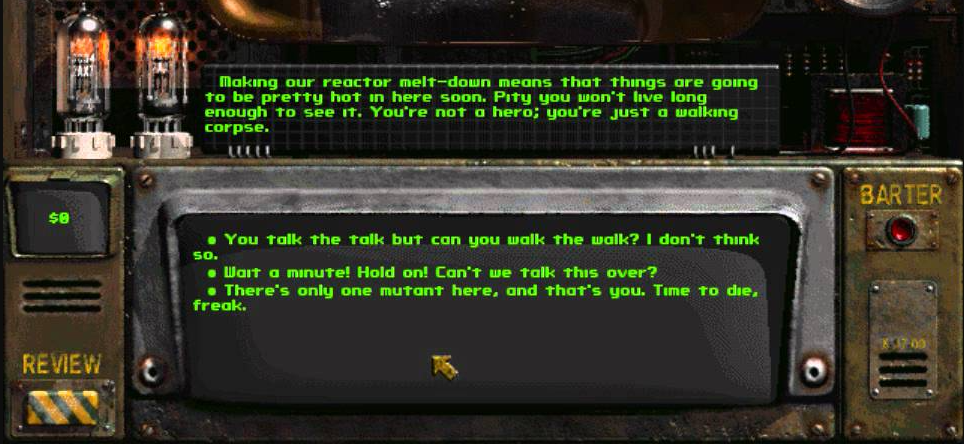
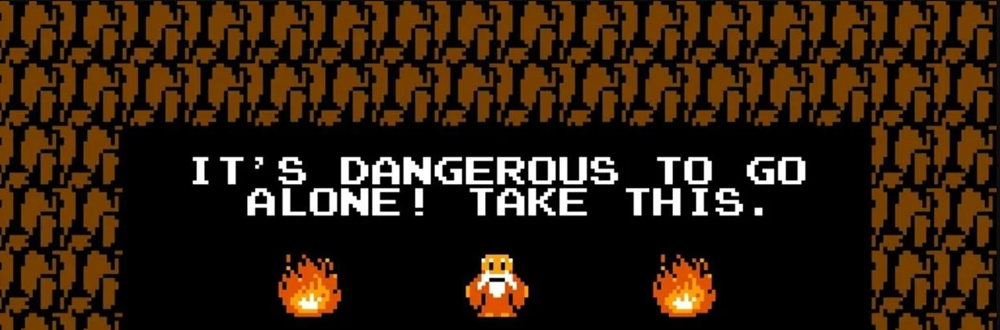
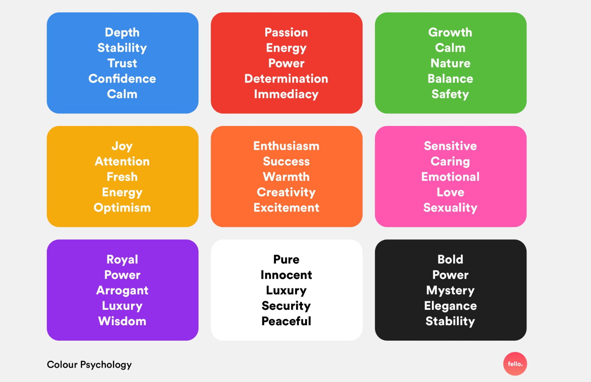
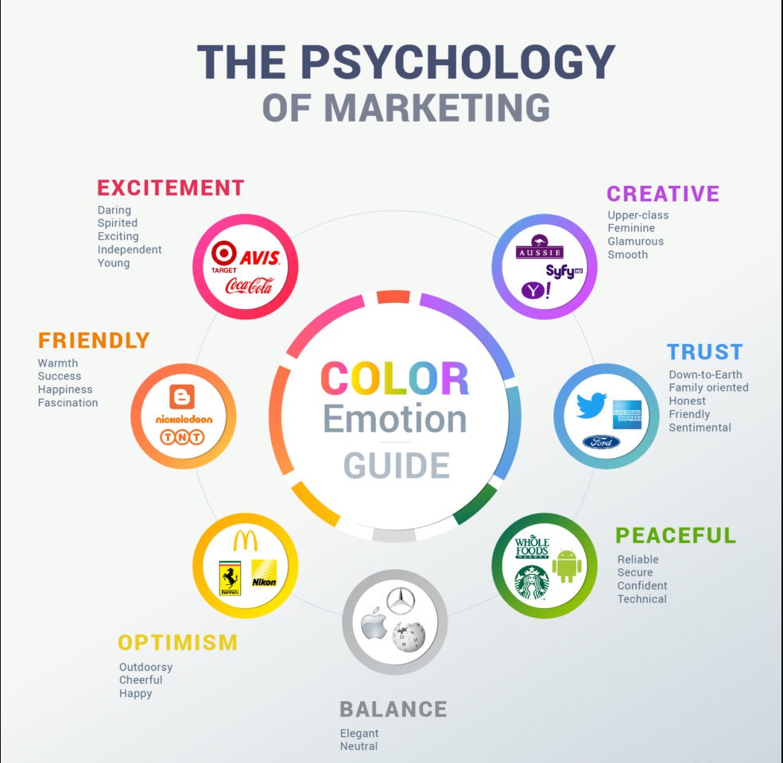

# Return myCoffee

[View live project here](https://ellenst264.github.io/return-my-coffee/)

This web-application is a fun, interactive game that combines popular mini-games together into one immersive experience. In Return myCoffee users must complete each mini-game in order to retrieve a cup of coffee that has been stolen from them!



-----

## Contents 

- [Project Purpose](#project-purpose)

- [User Experience (UX)](#user-experience-ux)

    - [User Stories](#user-stories)

- [Design](#design)
        
    - [Typography](#typography)

    - [Colour Scheme](#colour-scheme)

- [Technologies Used](#technologies-used)

  - [Languages](#languages)

  - [Frameworks, Libraries and Programs](#frameworks-libraries-and-programs)

- [Deployment](#deployment)

- [Credits](#credits)

  - [Code](#code)

  - [Content](#content)

  - [Inspiration](#inspiration)

  - [Acknowledgements](#acknowledgements)

  -----

## Project Purpose 

Return myCoffee is aimed at a target audience of all ages, who want to play a fun and simple browser game on their computer or on their tablet or mobile device. The aim of the application is to provide a fun and easy experience for users. It gives users a new way of playing popular mini-games by linking each game in a fun narrative, which allows the audience to immerse themselves into the game in an interactive, intuitive way.

### Project Goals

The most significant goal of this project is to ensure that the game is entertaining and easy to play. No downloads are necessary to play the game and it can be enjoyed on any device, making it easily accessible. This project strives to offer something new by presenting familiar mini-games to users in an unqiue and immersive way.

### Project Owner Goals

The primary goal is to create something unique - presenting a browser game that is responsive and enjoyable.

### Target Audience 

The target audience is open to anyone who is fond of playing quick fun mini-games such as the *memory card game*, *whack-a-mole* and *frogger*. However, there are subtle references to coding that an astute eye may pick up on - the most obvious one can be found in the game title name. 

-----

## User Experience (UX)

### User Stories

### First Time Visitor Goals

- As a first time visitor I want to immediately understand the purpose of the application.

- As a first time visitor I want to play an interactive browser based game that is easy to use, fun and intuitive.

- I want the game to have a challenge in terms of a timelimit or a score I need to beat.

- I want to be able to change the difficulty of the game.

- I want to be able to play the game on any device.

- I want the game instructions to be clear.

- I want the game's user interface to be pleasant.


### Returning Vistor Goals

- As a returning visitor I want to try and beat my high score, which means I expect a local storage system which will save my score for the game.

- As I have played the game before, I now seek a bigger challenge, so I want to be able to change the difficulty of the game.

-----

## Design 

### Typography 

I have imported the following fonts from the [Google Fonts](https://fonts.google.com/) library to use in my project:

- [Source Code pro](https://fonts.google.com/specimen/Source+Code+Pro?query=code)

- [Nanum Gothic Coding](https://fonts.google.com/specimen/Nanum+Gothic?query=nan)

- [Inconsolata](https://fonts.google.com/specimen/Inconsolata?query=incon)

- [Roboto](https://fonts.google.com/specimen/Roboto)

- [Roboto Mono](https://fonts.google.com/specimen/Roboto+Mono?query=robot)

Source Code Pro, Nanum Gothic Coding, Inconsolata and Roboto Mono have Monospace as a fallback font in case the fonts fail. 

Roboto has a fallback font of Sans Serif incase it fails to import.

All of the fonts have a similar style, but their subtle differences help add visual variety to the project to make it more interesting. I chose this style of font to stress the project's purpose. The fonts can easily be associated with arcade games, older RPG games and/or text-based games. Examples of this are displayed below:

| Example 1 | Example 2 | Example 3 |
| --------- | --------- | --------- |
|  |  |  |


It was important to ensure that I chose a typography style that was clear, readable and consistent. I believe each page achieves this and promotes the project theme effectively.

Each page uses the following fonts:

- Hompage 
    - Source Code Pro
    - Nanum Gothic Coding
    - Inconsolata
    - Roboto Mono

- Memory Game 
    - Source Code Pro

- Whack-A-Mole
    - Roboto 

- Frogger
    - Roboto

- Roboto was used for the game user interface in Whack-A-Mole and Frogger.

  - Roboto is more readble than the other fonts when against a visually packed background. When the screen size becomes smaller, it is increasingly easier to read than the former fonts. This is why Roboto was used for both Whack-A-Mole and Frogger - to ensure that users could see the user interface clearly. 


### Colour Scheme

In the initial design phase I opted to try out a 'coffee' colour scheme for the Homepage, which can be seen [here](assets/wireframes/homepage-old.png). However when the time came to write the code and I had the design properly laid out on the browser, the design choice didn't seem right. So I went back to the surface plane and redesigned the layout and colour scheme entirely.

|  |  |
| --------- | --------- |
|  |  |

I wanted the project to be vibrant, colourful and eye-catching, and it was imperative for the design to envoke a positive emotional response from the user.

The primary colour scheme for the **Homepage** is blue, green and yellow. 

- Blue is trustworthy and peaceful colour. It is a friendly colour, which makes the application more approachable and incites relaxtion. This ties in nicely with the application's purpose as people often play games to unwind.

- Green is a calming, reassuring colour. It is heavily associated with nature which links with the project's visual imagery in regards to the background images that are used. It is also associated with moving forward, like green in a traffic light, which can incite users to play the game.

- Yellow is a cheerful, optimistic colour, which is associated with the outdoors. Like green, this alludes to the project's visual theme. Yellow can also link to the colour of coffee!

- Blue green and yellow all combine nicely to create the atmosphere of being outdoors. This is where I would like to imagine that the game narrative is set, which is implied with textual content, background images and colours.

-----

### Wireframes 

I prepared all my wireframes in [Adobe XD](https://www.adobe.com/uk/products/xd.html). Adobe XD allowed me to experiment with the appliation's design before creating any of the code and helped with the construction of the surface plane. After writing the code, however, some design choices were altered, and I even went back to Adobe XD to recreate the design for the homepage. All of these design stages can be accessed below.

Each page has a wireframe for both desktop and mobile devices. I did not include a tablet wireframe in the design phase because there is no stark differences between tablet and desktop (for larger tablet devices) or tablet and mobile for smaller tablet devices. Additionally, many laptops also have touchscreen functionality, making the similarity even greater.

The only difference between tablet and desktop is the collapsible navbar with the hamburger icon. This alteration is represented in the mobile wireframe.

- [Homepage - old](assets/wireframes/homepage-old.png) 
- [Homepage - new](assets/wireframes/homepage1.png) and [this](assets/wireframes/homepage2.png)
- [Game setting menu](assets/wireframes/game-settings.png)
- [Memory game](assets/wireframes/memory-game.png)
- [Whack-A-Mole](assets/wireframes/whack-a-mole.png)
- [Frogger](assets/wireframes/frogger.png)
- [End game modal](assets/wireframes/end-modal.png)


-----


## Technologies Used

### Languages 

- HTML (5)
- CSS (3)
- Javascript

### Frameworks, Libraries and Programs 

- [Bootstrap 4.4.1](https://getbootstrap.com/)
  - Bootstrap was used to aid with responsiveness of the homepage and formed a foundation for styling the website.
  
- [Google Fonts](https://fonts.google.com/)
  - Google fonts was used to add visual variety to the typography and help maintain a visual theme.

- [Font Awesome 5.14](https://fontawesome.com/)
  - Font Awesome was used sparingly for adding icons or image cues to the project to employ a good UX design.
  
- [Adobe XD](https://www.adobe.com/uk/products/xd.html)
  - Adobe XD was used to create the wireframes during the design process.
  
- [Visual Studio Code](https://code.visualstudio.com/)
  - Visual Studio Code was the software used to write the code. 
  
- [Git](https://git-scm.com/)
  - Git was used for version control by utilising the PowerShell terminal in Visual Studio Code to commit to Git and push to GitHub.
  
- [GitHub](https://github.com/)
  - GitHub is used to store the project's code after being pushed to Git. It acts as a cloud-based service to store the project’s assets and code, which means we need not rely on saving locally alone. 

- [Smartmockups - Free Product Mockup Generator](https://smartmockups.com/)
  - Smartmocks is a web-application that allows you to create free mockup images. I used it in this readme file to present a mockup image of the project.

- [PicResize - Crop, Resize, Edit images online](https://picresize.com/)
  - PicResize is a web-application that allows you to resize images and alter their width/height and pixel size. I used PicResize to resize a variety of images in the project, such as the navbar brand, memory-game cards and mole images.

- [Asana](https://app.asana.com/0/home/1192103038725952)
  - Asana is a web and mobile application designed to help you organise, track and manage your projects. It was used to organise my project and schedule each task efficiently.

- [Autoprefixer CSS Online](https://autoprefixer.github.io/)
  - Autoprefixer is a PostCSS plugin which parses your CSS and adds vendor prefixes. It was used to prefix my main CSS file to ensure greater compatibility on a wide range of devices and browsers. 

- [Ezgif.com](https://ezgif.com/webp-to-png)
  - Ezgif is an online gif editor and image editor. It was used to edit some of the gif images that have been used throught the project.

- [Krita](https://krita.org/en/)
  - Krita is a free art software which can be downloaded on your desktop. I used Krita to make the memory-card images and the mole art in the settings menu modal.

- [Paint 3D](https://www.microsoft.com/en-gb/p/paint-3d/9nblggh5fv99?activetab=pivot:overviewtab)
  - Paint 3D is a free photo editing program which is pre-installed on Windows 10. I used Paint 3D to make minor adjustments to images and remove whitespace with the cropping tool so that they were easier to minipulate with CSS.

-----

## Deployment 

The website was developed using [Visual Studio Code](https://code.visualstudio.com/), while [Git](https://git-scm.com/) was used for version control - to push commits to GitHub, which hosts the repository. I deployed the website to GitHub Pages using the following steps:

### GitHub Pages 

1. Open **GitHub** in your browser and **sign in** to your GitHub account.
2. Locate the project's GitHub **repository**.
3. At the top of the project's repository (not the top of the screen) select the **'Setting'** button from the menu.
4. On the Settings, scroll down the default page until you locate the **'GitHub Pages'** section (near the bottom of the page). 
5. Under **'Source'**, click the **dropdown-menu** called 'None' and in **'select branch' choose 'master'**.)
6. Click **Save** to confirm your selection. The page will automatically refresh.
7. Scroll back down to 'GitHub Pages' and you will see a link to your deployed site.
8. You're done!

### Make a Local Clone

1. **Sign in** to your **GitHub** and locate the project's GitHub **repository**.
2. Under the repository name, click the **green 'Clone' button**.
3. To clone the repository using **HTTPS**, make sure the **HTTPS** is clicked (it will be underlined in orange) and **copy the link** provided.
4. Open **Git Bash**
5. Change your current working directory to the location where you want the cloned directory to be.
6. In the **terminal** type `git clone` and **paste the URL** you copied in step 3.
```
$ git clone https://github.com/YOUR-USERNAME/YOUR-REPOSITORY
```
7. Press **Enter** - your local clone is created.
```
$ git clone https://github.com/YOUR-USERNAME/YOUR-REPOSITORY
> Cloning into `CI-Clone`...
> remote: Counting objects: 10, done.
> remote: Compressing objects: 100% (8/8), done.
> remove: Total 10 (delta 1), reused 10 (delta 1)
> Unpacking objects: 100% (10/10), done.
```

-----

## Credits

### Code

- [Bootstrap 4](https://getbootstrap.com/) was used for the Homepage and Game Setting Modals. It has been used to construct the following features:
  - Mobile responsiveness through use of its grid system.
  - Responsive navbar
  - Design foundation for some buttons
  - Jumbotron in the Homepage

- [W3Schools](https://www.w3schools.com/) was used as guidance when creating my own modals that were not influenced by Bootstrap.

- The jumbotron background image on the homepage was based upon [this source](https://coder-coder.com/background-image-opacity/")

- Code for the Memory Game (HTML, CSS and JavaScript) was based upon [this YouTube tutorial](https://www.youtube.com/watch?v=ZniVgo8U7ek) by FreeCodeCamp.org

- Code for the Whack-A-Mole game (HTML, CSS and JavaScript) was based upon [this YouTube tutorial](https://www.youtube.com/watch?v=RTb8icFiSfk&list=PLYElE_rzEw_sowQGjRdvwh9eAEt62d_Eu&index=3) by Franks Laboratory.

- Code for the Frogger game (HTML, CSS and JavaScript) was based upon [this YouTube tutorial](https://www.youtube.com/watch?v=GXvNEwu9cgM&list=PLYElE_rzEw_sowQGjRdvwh9eAEt62d_Eu&index=4) by Franks Laboratory.

- The code used to shuffle the cards in the Memory Game was based upon [this code snipppet](https://jsfiddle.net/z503fjv9/)

- The code used to add touchscreen swipe controls to Frogger was written by Kirupa Chinnathambi and can be accessed via [here](https://stackoverflow.com/questions/53192433/how-to-detect-swipe-in-javascript) or [here](https://www.kirupa.com/html5/detecting_touch_swipe_gestures.htm)

- To fix null errors in the console, I looked to [this Stack Overflow post](https://stackoverflow.com/questions/26107125/cannot-read-property-addeventlistener-of-null)

- To animate the progress bar timer, I based my code of [this source](https://www.coding.academy/blog/how-to-create-a-smooth-animated-progress-bar)

- The pulsing animation for the 'Start Game' button in Frogger was based upon [this Codepen source](https://codepen.io/seansean11/pen/dhwzj)

- The code to make the animated clock in each game was taken from [this Codepen source](https://codepen.io/MyXoToD/pen/psLen)


### Content

- All content was written by the developer

- However, please note that the games would not exist without the tutorial guides from the following channels:

  - [Franks Laboratory](https://www.youtube.com/channel/UCEqc149iR-ALYkGM6TG-7vQ) - [this](https://www.youtube.com/watch?v=RTb8icFiSfk&list=PLYElE_rzEw_sowQGjRdvwh9eAEt62d_Eu&index=3) and [this](https://www.youtube.com/watch?v=GXvNEwu9cgM&list=PLYElE_rzEw_sowQGjRdvwh9eAEt62d_Eu&index=4) video were used for the project.

  - [FreeCodeCamp.org](https://www.youtube.com/channel/UC8butISFwT-Wl7EV0hUK0BQ) - [this](https://www.youtube.com/watch?v=ZniVgo8U7ek) video was used for the project.

- The majority of the web-application's media content (gifs and images) were **not** created by the developer.


### Media 

- A variety of coffee-themed gifs were taken from [here](https://giphy.com/stickers/g0HiibIiGp2oWQjMy5) and were created by the talented Dave Gamez.

- The keyboard icon images used in the help page for Frogger, was taken from [this GitHub page](https://github.com/q2apro/keyboard-keys-speedflips)

- The background images and spritesheets used in the Frogger game were taken from [Franks Laboratory's](https://www.youtube.com/channel/UCEqc149iR-ALYkGM6TG-7vQ) website, [found here](http://frankslaboratory.co.uk/frogger-game-with-vanilla-javascript/)

- The remaining gifs and images were taken from Google, apart from the memory game cards, which I made myself.


### Acknowledgements

- [CodeInstitute](https://codeinstitute.net/) for the course material, knowledge and inspiration.

- [W3Schools](https://www.w3schools.com/) for its high quality guides.

- [StackOverflow](https://stackoverflow.com/) for the perpetual source of help and inspiration.

- [Slack Community](https://slack.com/intl/en-gb/) for all the help, advice and inspiration.

- [Bootstrap](https://getbootstrap.com/) for the CSS and JQuery framework.

- [FreeCodeCamp.org](https://www.youtube.com/channel/UC8butISFwT-Wl7EV0hUK0BQ) for the great tutorial on how to make your own memory game.

- [Franks Laboratory](https://www.youtube.com/channel/UCEqc149iR-ALYkGM6TG-7vQ) for the amazing, high-quality tutorial videos which were used for the Whack-A-Mole game and Frogger. 

- [Franks Laboratory](https://www.youtube.com/channel/UCEqc149iR-ALYkGM6TG-7vQ) for the media content used in the Frogger game (spritesheets and background images), which he has made accessible to the public.

- I also want to thank my mentor, Can Sucullu, for his help and valuable suggestions throughout this project.

- Finally, I want to thank friends and family members for their continual support and feedback. 
