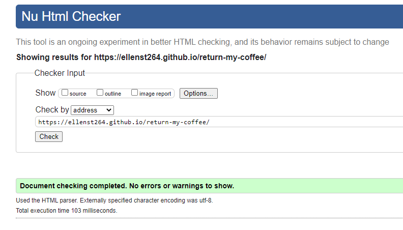
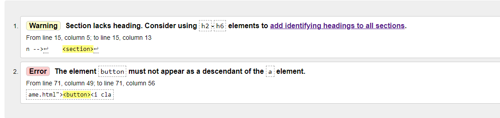
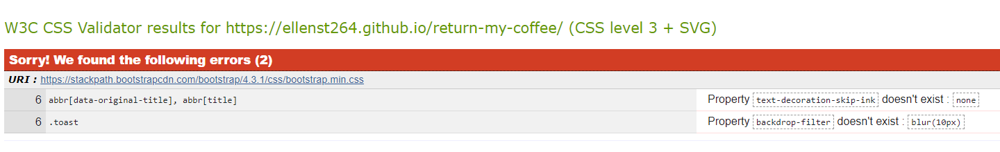
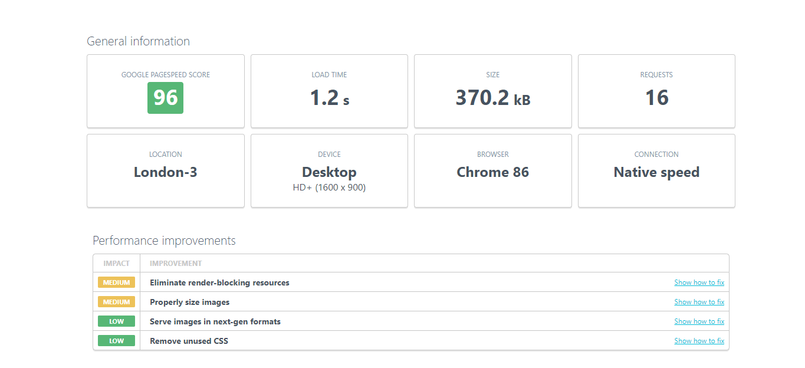
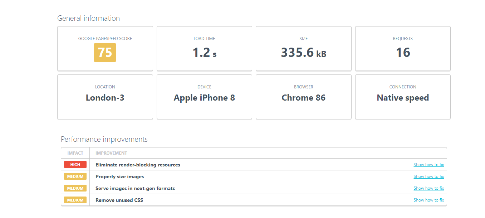
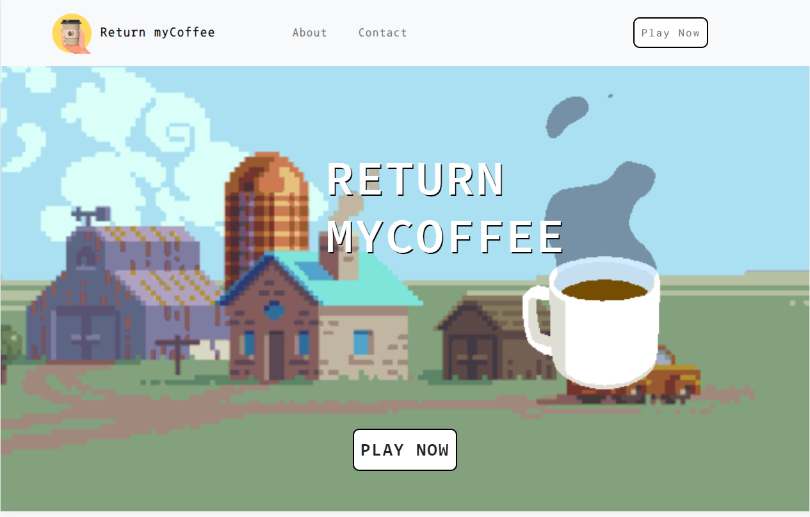
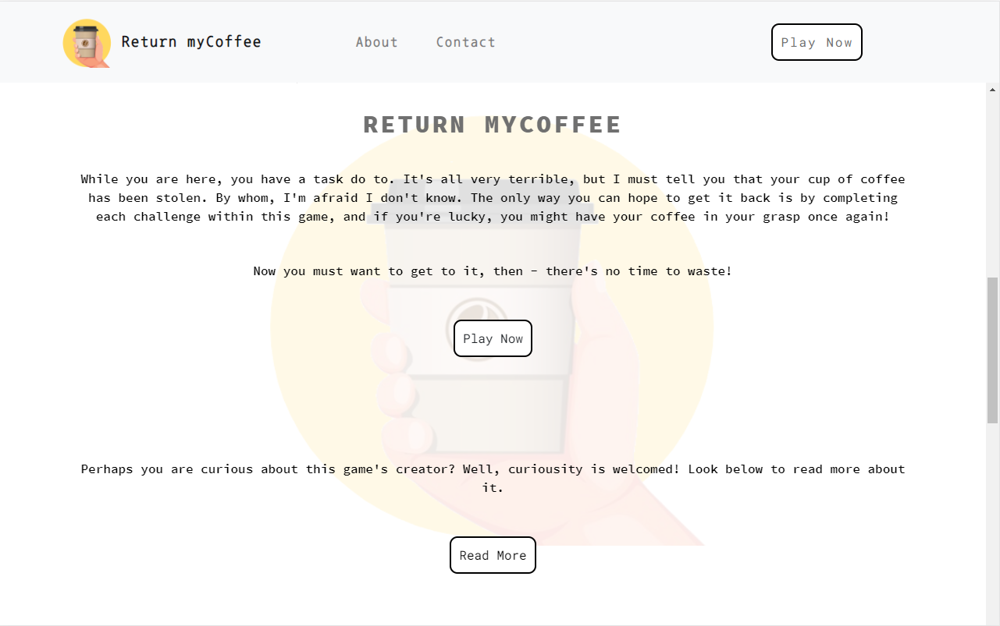

# Testing

## Contents

- [Automated Testing](#automated-testing)

    - [W3C Validation Service](#w3c-markup-validation-service)

    - [W3C CSS Validation Service](#w3c-css-validation-service)

    - [JSHint](#jshint)

    - [Page Speed / Performance](#page-performance)

- [Testing User Stories](#testing-user-stories)

    - [First Time Visitor Goals](#first-time-visitor-goals)

    - [Returning Visitor Goals](#returning-visitor-goals)

-----


## Automated Testing


[W3C Markup Validation Service](https://validator.w3.org/), [W3C CSS Validation Service](https://jigsaw.w3.org/css-validator/) and [JShint](https://jshint.com/) were used to validate the project's HTML, CSS and JS files.


### W3C Markup Validation Service



- The validator found errors in my HTML code relating to the nesting of button and anchor tags.

    - Where relevant, I removed button tags from the HTML and added the `btn class` to anchor elements so that no visual aesethic was changed, meanining the anchor tags could still look like buttons.d

- The validator also flagged a warning relating to section tags in some of the HTML files, stating how every section should contain a header element.

    - I removed and/or replaced the section tags with div tags, where appropriate. 



- No other errors were found.


-----

### W3C CSS Validation Service

- Found no errors in my code.



- However, it found some errors with the Bootstrap CDN, but this is something that I cannot rectify.


-----

### JSHint

JShint gave the following warnings in relation to the syntax of my code:

- `'const' is available in ES6 (use 'esversion: 6') or Mozilla JS extensions (use moz).`

- `'let' is available in ES6 (use 'esversion: 6') or Mozilla JS extensions (use moz).`

- `'arrow function syntax (=>)' is only available in ES6 (use 'esversion: 6').`

After deeming these warning undetrimental to the overall functionality of my project, I decided to ignore these warnings. 


- All typos in the code that were found by JShint were corrected.

- No major errors were found.


#### Memory Game JShint

When running `memory-cards.js` for **memory-game** in JShint, it gave the following warnings:


- `Expected an assignment or function call and instead saw an expression.` referred to this line of code:

```
isMatch ? disableCards() : unflipCards();
```

- Fix:

    - To fix this warning I changed the code from a ternary operator to a regular if statement:

    ```
    if (!isMatch) {
        unflipCards();
    }
    else {
        disableCards();
        totalMatches ++;
    }
    ```

- `'destructuring assignment' is available in ES6 (use 'esversion: 6') or Mozilla JS extensions (use moz).` referred to the following:

```
function resetBoard() {
    [hasFlippedCard, lockBoard] = [false, false];
    [firstCard, secondCard] = [null, null];
}
```
- Fix:

    - To fix this warning I changed the code to the following:

    ```
    function resetBoard() {
        hasFlippedCard = false;
        lockBoard =false;
        firstCard = null;
        secondCard = null;
    }
    ```

-----

### Page Performance 

I used [UpTrends](https://www.uptrends.com/tools/website-speed-test) to check the speed of my website. Here are my results when using the service:

| Desktop | Mobile |
| ------- | ------ |
|  | 


Although the test for desktop devices gave a good score, the mobile results could have been better. However, as this is a game-orientated application, most optimised for desktop, I did not see this matter as a raise for concern. No further action was taken.


-----


## Testing User Stories

### First Time Visitor Goals 

1. As a first time visitor I want to immediately understand the purpose of the application.

    

    - When first opening the site users are presented with a clean user-interface consisting of a navbar, hero-image, and a 'Play Now' button on top of the hero-image and in the navbar. The 'Play Now' button is distinct and repeated twice, which emphaises the purpose of the appliation to the user - with 'play' indicating it is a game.

    

    - Users can scroll down to read more about the application. The text immerses users into a game narrative and again emphaises the application's purpose with the 'Play Now' button. Users can also read about the application's creation by clicking the read more button.


2. As a first time visitor I want to play an interactive browser based game that is easy to use, fun and intuitive.


3. I want the game to have a challenge in terms of a timelimit or a score I need to beat.

4. I want to be able to change the difficulty of the game.

5. I want to be able to play the game on any device.

6. I want the game instructions to be clear.

7. I want the game's user interface to be pleasant.


### Returning Vistor Goals

1. As a returning visitor I want to try and beat my high score, which means I expect a local storage system which will save my score for the game.

2. As I have played the game before, I now seek a bigger challenge, so I want to be able to change the difficulty of the game.


-----


## Memory Game

### JavaScript Creation and Testing Process

### Memory Game

- To first test if the CSS "flip" class worked as intended, I used `card.classList.toggle("flip")` which allowed me to toggle the flip animation on and off when clicking the card.
    - Once I knew this worked as intended, I replaced the toggle method with the `add` method, as I did not want users to be able to flip the cards back to the default back-face by themselves.
    - The flip animation was then handled in its own function so that it could handle more complex behaviours.

- Once the `checkCards()` function was made, I recieved the following error in the console: `Failed to execute 'removeEventListener' on 'EventTarget': 2 arguments required, but only 1 present.` 
    - This was caused by two snippets of code exisiting within the function:
```
card.addEventListener("click", function(){
[...]
if (firstCard.dataset.cardname === secondCard.dataset.cardname) {
    // It's a match!
    firstCard.removeEventListener("click");
    secondCard.removeEventListener("click");
}
})
```
To fix the error, I separated the code into two functions, and made the following alterations:
```
cards.forEach((card)=> {
    card.addEventListener("click", checkCards);
})
function checkCards() {
    ....
    if (firstCard.dataset.cardname === secondCard.dataset.cardname) {
        // It's a match!
        firstCard.removeEventListener("click", checkCards, false);
        secondCard.removeEventListener("click", checkCards, false);
    }
}
```
I looked to this [StackOverflow post](https://stackoverflow.com/questions/13474370/behavior-of-removeeventlistener) to help me fix the issue.


### Frogger

- Once the touchscreen controls were added to Frogger, the following error was presented in the console:

```
[Violation] Added non-passive event listener to a scroll-blocking 'touchstart' event. Consider marking event handler as 'passive' to make the page more responsive. See https://www.chromestatus.com/feature/5745543795965952
```

It referred to these two lines of code in `swipe.js`:
- `gameboard.addEventListener("touchstart", startTouch, false);`
- `gameboard.addEventListener("touchmove", moveTouch, false);`

I looked to [this StackOverflow post](https://stackoverflow.com/questions/39152877/consider-marking-event-handler-as-passive-to-make-the-page-more-responsive) to fix the console error, changing the code to:
```
gameboard.addEventListener("touchstart", startTouch, {passive: true});
gameboard.addEventListener("touchmove", moveTouch, {passive: true});
```


- After that I had the following console error whenever a swipe motion was logged by the application:

```
swipe.js:73 Unable to preventDefault inside passive event listener invocation
```

I removed `e.preventDefault();` from swipe.js to fix the issue.