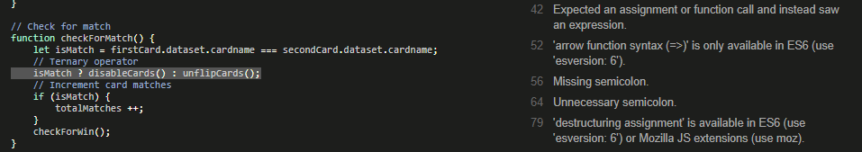
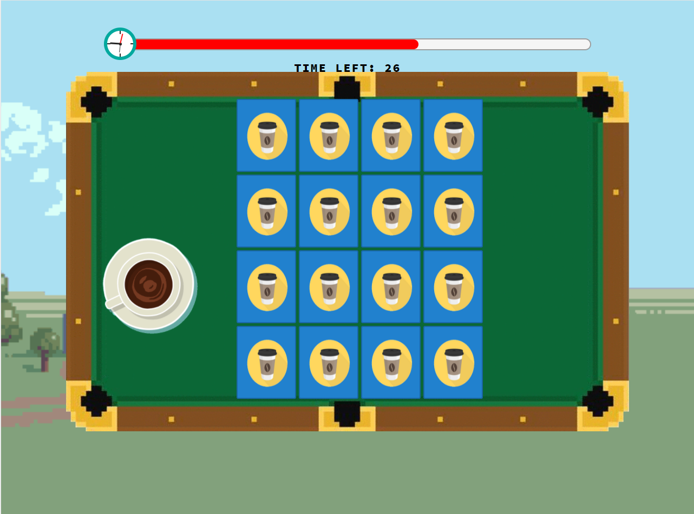
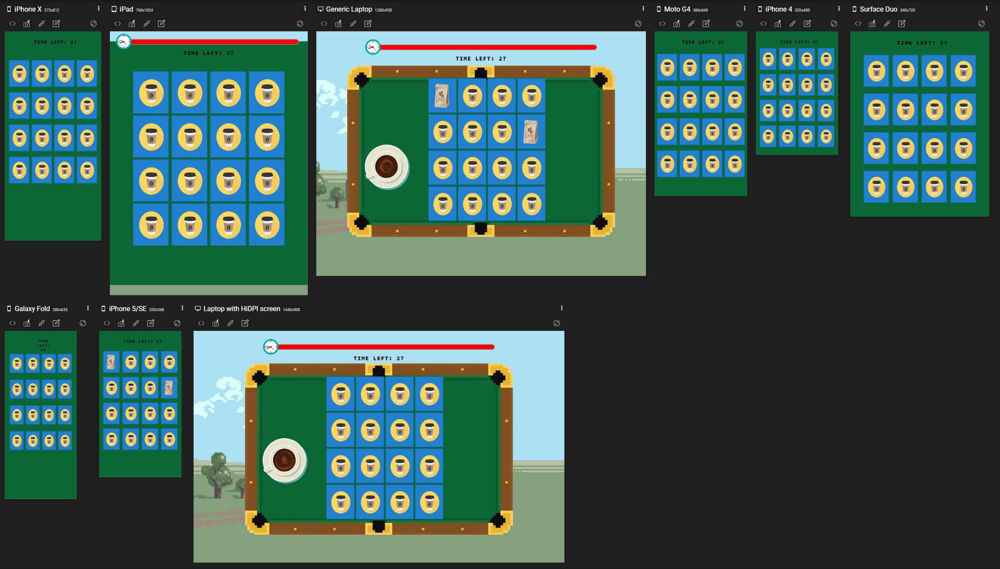

# Testing

## Contents

- [Automated Testing](#automated-testing)

    - [W3C Validation Service](#w3c-markup-validation-service)

    - [W3C CSS Validation Service](#w3c-css-validation-service)

    - [JSHint](#jshint)

    - [Page Speed / Performance](#page-performance)

- [Testing User Stories](#testing-user-stories)

    - [First Time Visitor Goals](#first-time-visitor-goals)

    - [Returning Visitor Goals](#returning-visitor-goals)

- [Manual Testing](#manual-testing)

    - [Navigation Bar - Desktop](#navigation-bar---desktop)

    - [Navigation Bar - Mobile and Tablet](#navigation-bar---mobile-and-tablet)

    - [Homepage and About Section](#homepage-and-about-section)

    - [Contact Form](#contact-form)

    - [Game Settings Menu](#game-settings-menu)

    - [Memory Game](#memory-game)

    - [Whack-A-Mole](#whack-a-mole)

    - [Frogger](#frogger)

    - [Frogger - End Game Modal](#frogger---end-game-modal)

- [Bug Fixes](#bug-fixes)

    - [Memory Game](#memory-game-1)

        - [Remove Event Listener Error](#remove-event-listener-error)

        - [Network Error](#network-error)

    - [Whack-A-Mole](#whack-a-mole-1)

        - [Touchscreen Blue Border Visual Bug](#touchscreen-blue-border-visual-bug)

        - [Unclickable Mole](#unclickable-mole)

    - [Frogger](#frogger-1)

        - [Highscore modal](#highscore-modal)

        - [Touchscreen controls](#touchscreen-controls)

-----


## Automated Testing


[W3C Markup Validation Service](https://validator.w3.org/), [W3C CSS Validation Service](https://jigsaw.w3.org/css-validator/) and [JShint](https://jshint.com/) were used to validate the project's HTML, CSS and JS files.


### W3C Markup Validation Service


- The validator found errors in my HTML code relating to the nesting of button and anchor tags.

    - Where relevant, I removed button tags from the HTML and added the `btn class` to anchor elements so that no visual aesethic was changed, meanining the anchor tags could still look like buttons.

- The validator also flagged a warning relating to section tags in some of the HTML files, stating how every section should contain a header element.

    - I removed and/or replaced the section tags with div tags, where appropriate. 


- No other errors were found.


### W3C CSS Validation Service

- Found no errors in my code.


- However, it found some errors with the Bootstrap CDN, but this is something that I cannot rectify.


### JSHint

JShint gave the following warnings in relation to the syntax of my code:

- `'const' is available in ES6 (use 'esversion: 6') or Mozilla JS extensions (use moz).`

- `'let' is available in ES6 (use 'esversion: 6') or Mozilla JS extensions (use moz).`

- `'arrow function syntax (=>)' is only available in ES6 (use 'esversion: 6').`

After deeming these warning undetrimental to the overall functionality of my project, I decided to ignore these warnings. 


- All typos in the code that were found by JShint were corrected.

- No major errors were found.


#### Memory Game JShint

When running `memory-cards.js` for **memory-game** in JShint, it gave the following warnings:



- `Expected an assignment or function call and instead saw an expression.` referred to this line of code:

```
isMatch ? disableCards() : unflipCards();
```

- Fix:

    - To fix this warning I changed the code from a ternary operator to a regular if statement:

    ```
    if (!isMatch) {
        unflipCards();
    }
    else {
        disableCards();
        totalMatches ++;
    }
    ```

- `'destructuring assignment' is available in ES6 (use 'esversion: 6') or Mozilla JS extensions (use moz).` referred to the following:

```
function resetBoard() {
    [hasFlippedCard, lockBoard] = [false, false];
    [firstCard, secondCard] = [null, null];
}
```
- Fix:

    - To fix this warning I changed the code to the following:

    ```
    function resetBoard() {
        hasFlippedCard = false;
        lockBoard =false;
        firstCard = null;
        secondCard = null;
    }
    ```


### Page Performance 

I used [UpTrends](https://www.uptrends.com/tools/website-speed-test) to check the speed of my website. Here are my results when using the service:

| Desktop | Mobile |
| ------- | ------ |
|  | 


Although the test for desktop devices gave a good score, the mobile results could have been better. However, as this is a game-orientated application, most optimised for desktop, I did not see this matter as a raise for concern. No further action was taken.


-----


## Testing User Stories

### First Time Visitor Goals 

1. As a first time visitor I want to immediately understand the purpose of the application.

    

    - When first opening the site users are presented with a clean user-interface consisting of a navbar, hero-image, and a 'Play Now' button on top of the hero-image and in the navbar. The 'Play Now' button is distinct and repeated twice, which emphaises the purpose of the appliation to the user - with 'play' indicating it is a game.

    

    - Users can scroll down to read more about the application. The text immerses users into a game narrative and again emphaises the application's purpose with the 'Play Now' button. Users can read about the application's creation by clicking the 'Read More' button.


2. As a first time visitor I want to play an interactive browser based game that is easy to use, fun and intuitive.

    | Memory Game | Whack-A-Mole | Frogger |
    | ----------- | ------------ | ------- |
    |  |  |  |
    |  |  |  |

    - Each game has a clear and visually pleasing user-interface that does not hinder the user when playing the game. 
    
    - Each game is relatively simple to play and the games themselvers are widely popular, making it very likely that the user would already know the game rules. 

    - Each game stresses visual importance. Text is kept to a minimum, while game art, pictures and vibrant colours are used to make the game more visually stimulating and encourage a positive user response.


3. I want the game to have a challenge in terms of a time limit or a score I need to beat.

    - There is a time limit for every game, which is indicated at the top of the screen via the game hud.

    | Desktop | Mobile |
    | ------- | ------ |
    |  | 

    - The timer includes a visual progress bar timer and a numbered timer to make the time limit more clear.


4. I want to be able to change the difficulty of the game.

    

    - Before each game users can chose a **difficulty settings** for the game. 

    - Users can see what each **difficulty settings** is by clicking the **Help** button in the modal.

        


5. I want to be able to play the game on any device.

| Homepage | Modal Menu |
| -------- | ---------- |
|  |  |  |

| Memory Game | Whack-A-Mole | Frogger |
| ----------- | ------------ | ------- |
|  |  |  |

- The project is fully responsive and can be played on any device.

- All games, including Frogger, have touchscreen functionality, allowing the game to be played on touchscreen mobile devices as well as desktops.


6. I want the game instructions to be clear.

- Each game has a specifically designed help menu (which can be accessed via the game menu modal) where users can find instructions for each game.

| Memory Game | Whack-A-Mole | Frogger |
| ----------- | ------------ | ------- |
|  |  |  |


7. I want the game's user interface to be pleasant.

    - The user interface for each game is clean, vibrant, interesting and responsive, with a UX design that was purposefully created to incite a positive emotional response from the user.


### Returning Vistor Goals

1. As a returning visitor I want to try and beat my high score, which means I expect a local storage system which will save my score for the game.

    - Whack-A-Mole and Frogger both have a local storage system where a highscore is stored. 

    | Whack-A-Mole | Frogger |
    | ------------ | ------- |
    |  |  |

    - Memory game does not have a highscore system but one could be added in future developments.


2. As I have played the game before, I now seek a bigger challenge, so I want to be able to change the difficulty of the game.

    - Users can find a bigger challenge by picking a harder difficulty setting in the game settings menu, which is presented to them before each game. The harder the difficulty, the less amount of time users have to complete the game.


-----

## Manual Testing

## Homepage 

### Navigation Bar - Desktop

| No. |   Action    |   Input   |   Expected Output |   Actual Output   |   Result |  Further Comments |
| --- | ----------- | --------- | ----------------- | ----------------- | ---------| ----------------- |
|  1  | Navigate to `About` | Click the `About` nav link | The site will navigate to the `About` section | Navigates to `About` section | Pass |
|  2  | Navigate to `Contact` | Click the `Contact` nav link | The site will navigate to the `Contact` section | Navigates to `Contact` section | Pass |
|  3  | Navigate to the top of the homepage | Click the `navbar brand` | The site will navigate back up to the top of the homepage or stay where it is if already there | When at another section, the site navigates back up to the top of the homepage when the navbar brand is clicked. If already at the top of the page, it stays where it is | Pass |
|  4  | Start game | Click the `Play Now` button | The application will navigate to first game menu modal page so that users can start the game | Navigates to the first game menu modal page where users can start the game | Pass |


### Navigation Bar - Mobile and Tablet

| No. |   Action    |   Input   |   Expected Output |   Actual Output   |   Result |  Further Comments |
| --- | ----------- | --------- | ----------------- | ----------------- | ---------| ----------------- |
|  1  | Navbar links collapse on smaller devices | On `Chrome DevTools`, toggle device toolbar and change the viewport to a tablet or mobile device with a max width of 990px | Nav links should disappear and a `hamburger icon` should appear to the right. When clicked, it should open a `dropdown menu` with the nav links inside | The navbar collapses at 990px and a `hamburger icon` displays to the right. It displays the nav links via a `dropdown menu` when clicked | Pass |
|  2  | Navigate to `About` via the `dropdown menu` | Click the `About` nav link in the `dropdown menu` | The site will navigate to the `About` section | Navigates to `About` section | Pass |
|  3  | Navigate to `Contact` via the `dropdown menu` | Click the `Contact` nav link in the `dropdown menu` | The site will navigate to the `Contact` section | Navigates to `Contact` section | Pass |
|  4  | Navigate to the top of the homepage | Click the `navbar brand` | The site will navigate back up to the top of the homepage or stay where it is if already there | When at another section, the site navigates back up to the top of the homepage when the navbar brand is clicked. If already at the top of the page, it stays where it is | Pass |
|  5  | Start game | Click the `Play Now` button via the `dropdown menu` | The application will navigate to first game menu modal page so that users can start the game | Navigates to the first game menu modal page where users can start the game | Pass |


### Homepage and About Section

| No. |   Action    |   Input   |   Expected Output |   Actual Output   |   Result |  Further Comments |
| --- | ----------- | --------- | ----------------- | ----------------- | ---------| ----------------- |
|  1  | Start game when at the top of the homepage | Click the `Play Now` button when at the top of the homepage | The application will navigate to first game menu modal page so that users can start the game | Navigates to the first game menu modal page where users can start the game | Pass |
|  2  | Start game at `About` section | Click the `Play Now` when at `About` section | The application will navigate to first game menu modal page so that users can start the game | Navigates to the first game menu modal page where users can start the game | Pass |
|  3  | Show hidden text | Click `Read More` button | It should reveal hidden text content when the button is clicked. When clicked again, the button should then hide the content | Shows hidden text content when the `Read More` button is clicked. When clicked again, the button hides the content | Pass |


### Contact Form

| No. |   Action    |   Input   |   Expected Output |   Actual Output   |   Result |  Further Comments |
| --- | ----------- | --------- | ----------------- | ----------------- | ---------| ----------------- |
|  1  | Test `contact form` `input field` | Click a `text field` and input data by typing on the keyboard | Users will be able to `input data` into the `input field` of the `contact form` | Can input data into the `input field` | Pass | Tested for every `input field` |
|  2  | Test `required boolean attribute` functionality | Click the `send` button without inputting data | A notification will show by the first empty `required text field` telling the user to `input data`. The `send` function will be blocked until all `required text fields` are filled out | Displays a notification by the first empty `required text field` (in this case, `first name`) and tells the user to `input data`. The `send` button will not function whilst the `required text fields` are empty | Pass |
|  3  | Test `send button` with all data filled in | Fill in all data and click the `send` button | The form will send | Sends the form | Pass |
|  4  | Test `send button` without `Last Name` filled in | Fill in all data **but last name** and click the `send` button | The form will send | Sends the form | Pass |
|  5  | Test `email input type` | Click on the `email input field` and input data that **is not** an email (e.g. a 'name' or 'hi') | When `send` is clicked, it will display a notification telling the user to `include a '@' in the email address`. The `send` button will not function until this is resolved | Shows a notification telling the user to `include a '@' in the email address`. The `send` button is blocked | Pass |


### Game settings menu

- The following tests were made on all three game settings menu, which includes:
    - `game-one-menu.html` (memory card game)
    - `game-two-menu.html` (whack-a-mole)
    - `game-three-menu.html` (frogger)

| No. |   Action    |   Input   |   Expected Output |   Actual Output   |   Result |  Further Comments |
| --- | ----------- | --------- | ----------------- | ----------------- | ---------| ----------------- |
|  1  | Open `help page` | Click the `help` button | Should open the `help page` relevant to the game | Opens the relevant `help page` for the game | Pass |
|  2  | Return to `homepage` via the `Return to homepage button` | Click the `Return to homepage` button | Should go back to the `homepage` | Directs users back to the `homepage` | Pass |
|  3  | Return to `homepage` via the back button | Click the browser's back button | Should go back to the `homepage` | Directs users back to the `homepage` | Pass | 
|  4  | Tell users to pick a `difficulty setting` | Click `Find Your Coffee` or `Play` (for Frogger) without picking a `difficulty setting` | Should display an alert box telling users to pick a `difficulty setting` before playing | Displays an alert box telling users to pick a `difficulty setting` before playing | Pass |
|  5  | Provide feeback for a chosen `difficulty setting` | Click either the `Easy`, `Medium` or `Hard` button | Feedback should be provided below the text *you have chosen:*, based on what settings was chosen. For example, if `Easy` was chosen, it should display the text `Easy` below | Provides feedback based on what setting was chosen, which is displayed below the text *you have chosen:* | Pass | Tested for all three settings |
|  6  | Open game | Click `Find Your Coffee` or `Play` (for Frogger) **after** picking a difficulty setting | Should open either memory game, whack-a-mole or frogger (depending on what game menu modal is opened) after a short loading screen. If on the first menu, memory game should open after a short loading screen | Directs uses to a loading screen which then opens the correct game shortly after - relevant to what game menu was opened prior. When on the first menu, clicking `Find Your Coffee` opens the memory game after a loading screen | Pass |


### Memory Game 

| No. |   Action    |   Input   |   Expected Output |   Actual Output   |   Result |  Further Comments |
| --- | ----------- | --------- | ----------------- | ----------------- | ---------| ----------------- |
|  1  | Start the game | Click the `start game modal button` | Should allow users to play the game and trigger the timer to start | Starts the game timer and allows users to interact with the game | Pass |
|  2  | Timer starts | Click the `start game modal button` | Timer should start upon clicking `start game` | Timer starts | Pass | This includes both the `progress bar timer` and the `numbered timer`. A small bug is noted [here]() |
|  2  | Flip a card | Click the card face | Should flip the card over with an elegant flip animation | Trigger an animation, flipping the card over so that users can see the card's front-face | Pass |
|  3  | Can flip a second card | Click on a second card | Should flip the second card | Flips the second card over. Both cards remain with their faces shown to the user | Pass |
|  4  | Check for a match | N/A | Should check to see if the two cards match | Checks for a match between the two cards by checking if the two `data-cardname` variables defined in the HTML file are the same | Pass |
|  5  | Flip cards if a match is unsuccessful | N/A | Should flip the two cards back over to their back-face if they do not match | When the cards don't match, the flip over so that the user can no longer see their front-face | Pass |
|  6  | Disable card flip is a match is found | N/A | Cards should remain unflipped if a match is found. Users should be able to interact with the board and click over cards to find more matches | Disables card flip when a successful match is found. Users can interact with the gameboard and click other cards to find more matches | Pass | 
|  7  | `Lock board` when card flip animation is triggered | Click a card | When there are two cards that have a failed match, users should **not** be able to interact with any other cards until the two cards have flipped back over | The board **locks**, preventing users from clicking any other cards until completing the flip animation on the two cards that did not match. After that users are free to interact with the board again | Pass | This prevents the game from making a *fake* match. See [here]() for more details |
|  8  | `Shuffle` cards | N/A | Cards should be shuffled on reload | Upon loading the game all cards are randomly shuffled. When reloading the game for a second time, the cards a shuffled **again** with the cards in a different order from the last | Pass |
|  9  | `Lose game` when timer runs out | Wait for the timer to run out **without** making all, or any, card matches | Should display the `lose game modal` | Displays the `lose game modal` when the timer runs out without all the card matches | Pass | 
|  10 | `Try again` via the `lose game modal` | Click the `Try Again` button in the `lose game modal` | Should reload the game, reseting the cards and the timer so that users can play again to try and win the game | Reloads the game, resets the timer and resets all cards | Pass |
|  11 | Return to `homepage` via the `lose game modal` | Click the `Quit` button in the `lose game modal` | Should take users back to the `homepage` | Directs users to the `homepage` | Pass |
|  12 | `Win game` when all matches are found | Find **all** card matches before the timer runs out | Once all matches are found the `win game modal` should display on screen | Displays the `win game modal` once **all** card matches are found | Pass |
|  13 | Continue to next game via the `win game modal` | Click the `Continue` button via the `win game modal` | Should take users to the next game menu (for whack-a-mole) | Directs users to the next game menu | Pass |


### Whack-A-Mole

| No. |   Action    |   Input   |   Expected Output |   Actual Output   |   Result |  Further Comments |
| --- | ----------- | --------- | ----------------- | ----------------- | ---------| ----------------- |
|  1  | Start the game | Click the `start game modal button` | Should allow users to play the game and trigger the timer to start | Starts the game timer and allows users to interact with the game | Pass |
|  2  | Timer starts | Click the `start game modal button` | Timer should start upon clicking `start game` | Timer starts | Pass | This includes both the `progress bar timer` and the `numbered timer`. A small bug is noted [here]() |
|  3  | Trigger mole `pop-up` function | Click `start game modal button` | Moles should begin to pop up from their holes | Moles pop up from their holes once `start game` is clicked and the game timer begins | Pass | The mole pop-up speed depends on what `difficulty setting` was chosen in the previous game settings menu | 
|  4  | Whack mole | Click on the `mole` as it pops up from the hole | Once clicked by the user, the mole image should change to an angry mole. The score should increment by 1 | When clicked, or whacked, the mole image changes to an angry mole in order to provide visual feedback to the user. The score increments by 1 | Pass |
|  5  | Cheat test | Click a mole as it pops up from the hole, and **keep clicking** that **same mole** until it goes back down into its hole | The score should **only** increment by 1 | When clicking the **same mole** multiple times the score only increments by 1 to prevent *cheating* | Pass |
|  6  | Increment score test 2 | Click **empty** holes | The score should **not** increment | Score is only added when a user clicks a `mole`. When elsewhere is clicked, the score is **not** incremented | Pass |
|  7  | `Lose game` when timer runs out | Wait for the timer to run out **without** whacking any moles | Should display the `lose game modal` | Displays the `lose game modal` when the timer runs out without reaching the target score | Pass | 
|  7  | `Lose game` when timer runs out - test 2 | Reach a score of anything below **25** (increment the score by whacking moles) and wait for the timer to run out | Should display the `lose game modal` | Displays the `lose game modal` when the timer runs out without reaching the target score | Pass |
|  9  | `Try again` via the `lose game modal` | Click the `Try Again` button in the `lose game modal` | Should reload the game, reseting the cards and the timer so that users can play again to try and win the game | Reloads the game, resets the timer and resets all cards | Pass |
|  10  | Return to `homepage` via the `lose game modal` | Click the `Quit` button in the `lose game modal` | Should take users back to the `homepage` | Directs users to the `homepage` | Pass |
|  11 | `Win game` | Reach the **target score of 25** before the timer runs out | If the target score is met once time is up the `win game modal` should display on screen | Displays the `win game modal` if the target score as been met | Pass |
|  12 | `Win game` | Pass the **target score of 25** before the timer runs out | Should display the `win game modal` when the timer runs out | Displays the `win game modal` once the timer runs out because the user has surpassed the target score | Pass |
|  13 | Continue to next game via the `win game modal` | Click the `Continue` button via the `win game modal` | Should take users to the next game menu (for whack-a-mole) | Directs users to the next game menu | Pass |
|  14 | Store `highscore` | N/A | Should store the user's score as the `highscore` at the end of the game | After playing the game and then reloading the game, you can see that the `highscore` has been updated with the game's previous score | Pass |
|  15 | Update `highscore` | Reach a score that is higher than the current highscore | Should update the highscore with the new score if the current score is greater than the current highscore | Updates `highscore` if the current score is greater than the current highscore that was saved from the previous game | Pass |


### Frogger

| No. |   Action    |   Input   |   Expected Output |   Actual Output   |   Result |  Further Comments |
| --- | ----------- | --------- | ----------------- | ----------------- | ---------| ----------------- |
|  1  | Start the game | Click the `start game modal button` | Should allow users to play the game and trigger the timer to start | Starts the game timer and allows users to interact with the game | Pass |
|  2  | Timer starts | Click the `start game modal button` | Timer should start upon clicking `start game` | Timer starts | Pass | This includes both the `progress bar timer` and the `numbered timer`. A small bug is noted [here]() |
|  3  | Move frogger with the `arrow keys` | Press the `up arrow key` to move the frogger up | Frogger should jump up | Frogger jumps up | Pass |
|  4  | Move frogger with the `arrow keys` | Press the `down arrow key` to move the frogger down | Frogger should jump down | Frogger jumps down | Pass |
|  5  | Move frogger with the `arrow keys` | Press the `left arrow key` to move the frogger left | Frogger should jump left | Frogger jumps left | Pass |
|  6  | Move frogger with the `arrow keys` | Press the `right arrow key` to move the frogger right | Frogger should jump right | Frogger jumps right | Pass |
|  7  | Move frogger with the `W A S D keys` | Press the `W key` to move the frogger up | Frogger should jump forward | Frogger jumps forward | Pass |
|  8  | Move frogger with the `W A S D keys` | Press the `S key` to move the frogger down | Frogger should jump down | Frogger jumps down | Pass |
|  9  | Move frogger with the `W A S D keys` | Press the `A key` to move the frogger left | Frogger should jump left | Frogger jumps left | Pass |
|  10 | Move frogger with the `W A S D keys` | Press the `D key` to move the frogger right | Frogger should jump right | Frogger jumps right | Pass |
|  11 | Move frogger with `directional swiping` on `touchscreen` | `Swipe up` to move the frogger up | Frogger should jump up | Frogger jumps up | Pass | The `sprite animation` for the frogger doesn't work as desired, see [here]() for more details about the bug |
|  12 | Move frogger with `directional swiping` on `touchscreen` | `Swipe down` to move the frogger down | Frogger should jump down | Frogger jumps down | Pass | The `sprite animation` for the frogger doesn't work as desired, see [here]() for more details about the bug |
|  13 | Move frogger with `directional swiping` on `touchscreen` | `Swipe left` to move the frogger left | Frogger should jump left | Frogger jumps left | Pass | The `sprite animation` for the frogger doesn't work as desired, see [here]() for more details about the bug |
|  14 | Move frogger with `directional swiping` on `touchscreen` | `Swipe right` to move the frogger right | Frogger should jump right | Frogger jumps right | Pass | The `sprite animation` for the frogger doesn't work as desired, see [here]() for more details about the bug |
|  15 | `Collsion detection` - **car** | Move the frogger up and wait for a car to hit it | Collsion should be detected. A new frogger should appear at the **starting point** on the game canvas and a small collison image should display beside the frogger that was hit. `Collision count` should increment by 1 | Collision detected. A new frogger appears at the **starting position** and the `collision count` increments by 1. When hit, a small collision image representing a bang displays for a short moment beside the frogger to provide visual feedback to the user | Pass | The collision image can be easily missed and is often not positioned directly on top of the frogger. For more details see [here]() |
|  16 | `Collsion detection` - **water** | Move to the water, try to avoid any cars, but allow the frogger to **fall into the water** | Collsion should be detected. A new frogger should appear at the **starting point** on the game canvas and a small collison image should display beside the frogger once it falls into the water. `Collision count` should increment by 1 | Collision detected. A new frogger appears at the **starting position** and the `collision count` increments by 1. When the frogger falls into the water, a small collision image representing a splash displays for a short moment beside the frogger to provide visual feedback to the user, however this is very difficult to see | Pass | The collision image is quite difficult to see against the water which means it is easily missed. However as the ripple effect also provides visual feedback this is not a big issue. For more details see [here]() |
|  17 | `Collsion detection` - **logs and turtle** | Move to the water, try to avoid any cars, and then jump onto a **log** and then a **turtle** | Collision should be detected. The frogger should be able to ride on the log and the turtle in order to avoid falling into the water. If motionless for too long (if the frogger reaches the left or right edge of game canvas) then the frogger will 'fall' into the water. This will not be seen like before but the `collision count` should increment by 1 | Collision detected. The frogger can ride on the log and the turtle but once it passes the left and/or right edge of the game canvas, then it is considered that the frogger has fallen into the water, which increments the `collision count` by 1 | Pass |
|  18 | Count `score` | Reach the top of the canvas (past the water) without hitting any obstacles **or** falling into the water | The game `score` (represented by the heart icon) should increment by 1 | The game `score` increments by 1 once the frogger passes the top edge of the canvas | Pass | During the initial construction phases a bug was presented, which is explained in more detail [here]() however, this is now fixed |


### Frogger - end game modal

| No. |   Action    |   Input   |   Expected Output |   Actual Output   |   Result |  Further Comments |
| --- | ----------- | --------- | ----------------- | ----------------- | ---------| ----------------- |
|  1  | Open `end game modal` | Wait for the game timer to end | The frogger `end game modal` should display on screen | Displays the `end game modal` once the timer has run out | Pass |
|  2  | Log `score count`| Save froggers to increment the score by reaching the top edge of the game canvas | The `end game modal` should log how many froggers have been saved. If you had a score of 3, it should say `You saved 3 froggers!` | Reached a `score count` of 4; in the `end game modal` it said: `You saved 4 froggers!` | Pass |
|  3  | Log `score count` - test 2 | Wait for the game timer to end **without** moving the frogger from the starting position | The `end game modal` should log that **zero** froggers have been saved. It should say: `You didn't save any!` | The `end game modal` displayed the correct text. No froggers were saved, which meant the `score count` was zero, therefore the `end game modal` said: `You didn't save any!` | Pass |
|  4  | Log `collision count` - test 1 | Allow the frogger to either be hit by the cars or fall into the water in order to increment the `collision score` | The `end game modal` should log the `collision score`. If the `collision count` is 5, the `end game modal` should say: `And only 5 of them didn't make it...` | Had 6 `collisions`, the `end game modal` logged the `collision count correctly`, stating `And only 6 of them didn't make it...` | Pass |
|  5  |  Log `collision count` - test 2 | Wait for the game timer to end **without** moving the frogger from the starting position | The `end game modal` should log **zero** collisions **and** **zero** for the score count, therefore it should say `You didn't save any! But you also didn't lose any of them!` | The `end game modal` displayed the correct text. No froggers were saved and no collisions were detected, which meant the `score count` and the `collision count` were zero. The `end game modal` said: `You didn't save any! But you also didn't lose any of them!` | Pass |
|  6  |  Log `collision count` - test 3 | Save froggers to increment the score by reaching the top edge of the game canvas **but do not** get hit by any obstacles or fall into the water | The `end game modal` should log the `score count` and say: `You saved [x amount of] frogger! And you didn't lose any of them!` | Reached a `score count` of 3 **without** incrementing the `collision count`. The `end game modal` displayed the text: `You saved 3 froggers! And you didn't lose any of them!` | Pass |
|  7  | Log `highscore` | Play the game **without** beating the current highscore | The `end game modal` should log the existing highscore | The `end game modal` logs the existing highscore. In this case, the highscore was 3, so the modal said: `The highscore is 3, can you beat it next time?` | Pass |
|  8  | Log **new** `highscore` | Beat the current highscore by saving as any froggers as possible and limiting collisions to a minimum. The highscore is calculated as `score - collisionCount`. The `highscore` will only be logged if it is **greater than zero** | The `end game modal` should log the `new highscore` and say: `And wow! You beat the highscore. It is now: [new highscore]` | After beating the `highscore` the `end game modal` correctly logs the **new** highscore, stating: `And wow! You beat the highscore. It is now: 4` | Pass |
|  9  | Log `highscore` when highscore is **zero** | If the highscore needs to be cleared then type: `localStorage.clear("game2HighScore");` into the console in `Chrome DevTools`. Wait for the game timer to end | The `end game modal` should say: `The highscore is 0, can you beat it next time?` | The `end game modal` says: `And wow! You beat the highscore. It is now: 0` | Fail |
|  10 | Log `highscore` when highscore is **zero** - test 2 | (Following from `test 9`) Increment the `score count` by 1 **without** incrementing the `collision count` | The `end game modal` should say: `And wow! You beat the highscore. It is now: 1` | The modal says: `And wow! You beat the highscore. It is now: 1` | Pass | The function still works correctly after clearing the local storage in the console. After altering the code in `utilities.js` a fix was found, see [here](#highscore-modal) for details | 


-----

## Bug Fixes 


### Memory Game

#### Remove Event Listener Error

- Once the `checkCards()` function was made, I recieved the following error in the console: `Failed to execute 'removeEventListener' on 'EventTarget': 2 arguments required, but only 1 present.` 
    - This was caused by two snippets of code exisiting within the function:
```
card.addEventListener("click", function(){
[...]
if (firstCard.dataset.cardname === secondCard.dataset.cardname) {
    // It's a match!
    firstCard.removeEventListener("click");
    secondCard.removeEventListener("click");
}
})
```
To fix the error, I separated the code into two functions, and made the following alterations:
```
cards.forEach((card)=> {
    card.addEventListener("click", checkCards);
})
function checkCards() {
    ....
    if (firstCard.dataset.cardname === secondCard.dataset.cardname) {
        // It's a match!
        firstCard.removeEventListener("click", checkCards, false);
        secondCard.removeEventListener("click", checkCards, false);
    }
}
```
I looked to this [StackOverflow post](https://stackoverflow.com/questions/13474370/behavior-of-removeeventlistener) to help me fix the issue.


#### Network Error

When loading `game-two-menu.html` via Memory Game's `win game modal` the following error displayed in the console:


The error was caused by a line of code within the `endGame()` function in `utilities.js`: 
```
if (totalMatches === 8) {
        winGameModal.style.display = "block";
        continueBtn.addEventListener("click", function(){
            window.location.replace("game-two-menu.html");
        });
    }
```
- DevTools noted that line 39, `window.location.replace("game-two-menu.html");` was the cause of the error.

    - However, after testing I found it wasn't actually this line of code that caused the issue.
    
    - The issue arised from having an event listener **inside** the `endGame()` function

    - Moving the event listener for `continueBtn` **outside** of the function, resolved the error:

    ```
    continueBtn.addEventListener("click", function(){
        window.location.replace("game-two-menu.html");
    });

    function endGame() {
        lockBoard = true;
        // Check for win
        if (totalMatches === 8) {
            winGameModal.style.display = "block";
        }
        // Check for loss
        else {
            loseGameModal.style.display = "block";
            replayBtn.addEventListener("click", function(){
                window.location.reload();
            });
            quitBtn.addEventListener("click", function(){
                window.location.replace("index.html");
            });
        }
    }
    ```


-----

### Whack-A-Mole

#### Touchscreen Blue Border Visual Bug


#### Unclickable Mole

The mole became unclickable after `whack-a-mole.css` was changed in order to make the moles pop up from *behind* the holes.

- Adding `pointer-events: none;` to `.hole:after` in `whack-a-mole.css` fixed the issue.

- I looked to [this StackOverflow post](https://stackoverflow.com/questions/3680429/click-through-div-to-underlying-elements) for aid.


-----

### Frogger 

#### Highscore Modal

When reseting the local storage for the frogger highscore, as shown [here](), the Frogger `end game modal` began showing the incorrect modal text when logging the `highscore`. 

- It displayed: `And wow! You beat the highscore. It is now: 0`

    - When it should have displayed: `The highscore is 0, can you beat it next time?`

This was fixed by altering the following code, from: 

```
if (highscore < localStorage.getItem("game2HighScore")) {
        let showHighscore = document.querySelector("#showHighscore span");
        showHighscoreDiv.style.display = "block";
        showHighscore.textContent = localStorage.getItem("game2HighScore");
    }
```
to:
```
if (highscore === 0 || highscore < localStorage.getItem("game2HighScore")) {
        let showHighscore = document.querySelector("#showHighscore span");
        showHighscoreDiv.style.display = "block";
        showHighscore.textContent = localStorage.getItem("game2HighScore");
    }
```

However this then created a new problem: 


- The highscore count was blank, when it should have logged `0`

    - The cause for this was found when logging `"game2HighScore"` into the console: 

    

    - After **clearing** the local storage, `"game2HighScore"` was set to `null`. This was causing the bug.

To fix this I made the following alteration to the code:

```
if (highscore === 0 || highscore < localStorage.getItem("game2HighScore")) {
        let showHighscore = document.querySelector("#showHighscore span");
        showHighscoreDiv.style.display = "block";
        if (localStorage.getItem("game2HighScore") === null) {
            showHighscore.textContent = 0;
        }
        else {
            showHighscore.textContent = localStorage.getItem("game2HighScore");
        }
    }
```

#### Touchscreen Controls

- Once the touchscreen controls were added to Frogger, the following error was presented in the console:

```
[Violation] Added non-passive event listener to a scroll-blocking 'touchstart' event. Consider marking event handler as 'passive' to make the page more responsive. See https://www.chromestatus.com/feature/5745543795965952
```

It referred to these two lines of code in `swipe.js`:
- `gameboard.addEventListener("touchstart", startTouch, false);`
- `gameboard.addEventListener("touchmove", moveTouch, false);`

I looked to [this StackOverflow post](https://stackoverflow.com/questions/39152877/consider-marking-event-handler-as-passive-to-make-the-page-more-responsive) to fix the console error, changing the code to:
```
gameboard.addEventListener("touchstart", startTouch, {passive: true});
gameboard.addEventListener("touchmove", moveTouch, {passive: true});
```


- After that I had the following console error whenever a swipe motion was logged by the application:

```
swipe.js:73 Unable to preventDefault inside passive event listener invocation
```

I removed `e.preventDefault();` from swipe.js to fix the issue.


-----


## Some notes on the Construction Phase

### Memory Game 

- To first test if the CSS "flip" class worked as intended, I used `card.classList.toggle("flip")` which allowed me to toggle the flip animation on and off when clicking the card.

    - Once I knew this worked as intended, I replaced the toggle method with the `add` method, as I did not want users to be able to flip the cards back to the default back-face by themselves.

    - The flip animation was then handled in its own function so that it could handle more complex behaviours.